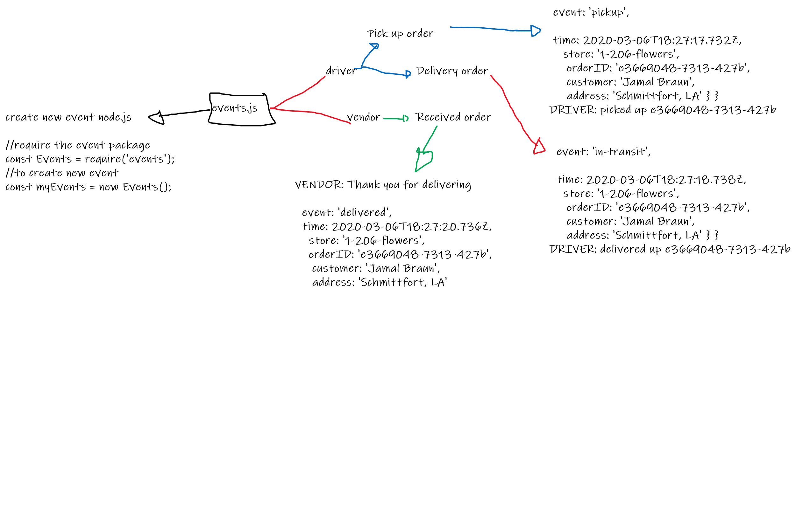

# Code-Academy-Parcel-Service

[github](https://github.com/naeemmusamh/Code-Academy-Parcel-Service)

[pull Request](https://github.com/naeemmusamh/Code-Academy-Parcel-Service/pull/1)

## basic structure

[dotenv](https://www.npmjs.com/package/dotenv)

Dotenv is a zero-dependency module that loads environment variables from a .env file into process.env.

[faker](https://www.npmjs.com/package/faker)

generate massive amounts of fake data in the browser

[event node.js](https://nodejs.org/api/events.html)

The eventEmitter.on() method is used to register listeners
The eventEmitter.emit() method is used to trigger the event

## Demo

